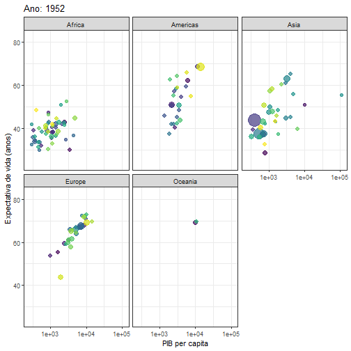

class:middle

```{r setup, include=FALSE}
# Dependências dos slides/aula
library(knitr)          # CRAN v1.33
library(rmarkdown)      # CRAN v2.10
library(xaringan)       # CRAN v0.22
library(xaringanthemer) # CRAN v0.3.0
library(xaringanExtra)  # [github::gadenbuie/xaringanExtra] v0.5.5
library(RefManageR)     # CRAN v1.3.0
library(ggplot2)        # CRAN v3.3.5
library(fontawesome)    # [github::rstudio/fontawesome] v0.1.0

# Opções de chunks
options(htmltools.dir.version = FALSE)
knitr::opts_chunk$set(
  echo       = TRUE,
  warning    = FALSE,
  message    = FALSE,
  fig.retina = 3,
  fig.width  = 6,
  fig.asp    = 0.618,
  out.width  = "100%",
  fig.align  = "center",
  comment    = "#"
  )

# Cores para gráficos
colors <- c(
  blue       = "#282f6b",
  red        = "#b22200",
  yellow     = "#eace3f",
  green      = "#224f20",
  purple     = "#5f487c",
  orange     = "#b35c1e",
  turquoise  = "#419391",
  green_two  = "#839c56",
  light_blue = "#3b89bc",
  gray       = "#666666"
  )
```

```{r xaringan, echo=FALSE}
# Tema da apresentação
xaringanthemer::style_mono_light(
  base_color                      = unname(colors["blue"]),
  title_slide_background_image    = params$logo_slides, 
  title_slide_background_size     = 12,
  title_slide_background_position = "bottom 10px right 20px",
  title_slide_background_color    = "white",
  title_slide_text_color          = unname(colors["blue"]),
  footnote_position_bottom        = "15px"
  )

# Opções extras do tema
xaringanExtra::use_scribble(pen_color = unname(colors["blue"]))
xaringanExtra::use_search(
  position  = "bottom-left", 
  show_icon = TRUE
  )
xaringanExtra::use_clipboard(
  button_text  = "Copiar", 
  success_text = "Copiado!",
  error_text   = "Pressione Ctrl+C para copiar"
  )
xaringanExtra::use_progress_bar(
  color    = colors["blue"], 
  location = "bottom"
  )
xaringanExtra::use_extra_styles(
  hover_code_line         = TRUE,
  mute_unhighlighted_code = FALSE
  )
xaringanExtra::use_panelset()

#xaringan::inf_mr() #Atualiza a apresentação enquanto é editada
```

```{css, echo=FALSE}
pre {
  white-space: pre-wrap;
  overflow-y: scroll !important;
  max-height: 45vh !important;
  overflow-x: auto;
  max-width: 100%;
}
```

```{r load_refs, echo=FALSE, eval=params$references}
# Configuração de citações
RefManageR::BibOptions(
  check.entries = FALSE,
  bib.style     = "authoryear",
  cite.style    = "authoryear",
  style         = "markdown",
  hyperlink     = FALSE,
  dashed        = FALSE
  )
if(params$references){
  temp_refbib <- tempdir()
  download.file(
    url      = params$references_path, 
    destfile = paste0(temp_refbib, "/references.bib"), 
    mode     = "wb"
    )
  myBib <- RefManageR::ReadBib(paste0(temp_refbib, "/references.bib"), check = FALSE)
  }

# Como citar?
# RefManageR::TextCite(myBib, "id_da_citacao")
```

```{r utils, echo=FALSE}
# Função que pega um arquivo .Rmd, condicionalmente o renderiza, 
# e embute o conteúdo do mesmo formatado como Markdown puro 
# no output do documento atual
print_rmd <- function(file, encoding = "UTF-8", render = TRUE){
  if(render){rmarkdown::render(input = file, quiet = TRUE)}
  rmd <- readLines(con = file, encoding = encoding)
  cat("```md\n")
  cat(rmd, sep = "\n")
  cat("```\n")
}
```


```{r, out.width="60%", fig.cap="<center><b>Sasuke Uchiha? Sharingan? Xaringan? </b></center>", echo=FALSE}

```

---

### Antes de começar

Esta aula está baseada em publicações da Análise Macro (http://www.analisemacro.com.br) e da Beatriz Milz (http://www.beatrizmilz.com).

Pacotes de R que devem estar instalados:

```{r, eval=FALSE}
library(xaringan)
library(xaringanthemer)
library(leaflet)
library(plotly)
library(highcharter)
library(palmerpenguins)
library(gt)
library(pagedown)
```

---
class: middle, center, inverse
# O pacote {xaringan}


---
### O pacote {xaringan}

.pull-left[

```{r, echo=FALSE, out.width="50%"}
knitr::include_graphics("imgs/xaringan.png")
```
.center[
Fonte: [xaringan package](https://github.com/yihui/xaringan)
]

]

.pull-right[

- Possibilita criar slides "ninjas" através do `R Markdown`;<br><br>
- Utiliza `JavaScript` e `CSS` internamente;<br><br>
- É altamente customizável e possui extensões;<br><br>
- Gera slides no formato `HTML` com interatividade;<br><br>
- É possível converter o HTML para PDF (estático);<br><br>
- É o formato padrão utilizado no material deste curso!

]


---
### Criando uma apresentação {xaringan}

.pull-left[

Para criar seu primeiro slide `xaringan` com o template básico, siga esses passos:

- É recomendável trabalhar dentro de um projeto de RStudio
- Navegue por `File >  New File > R Markdown > From Template > Ninja Presentation {xaringan} > OK`
- Salve o arquivo `.Rmd` e compile o documento usando o botão `Knit`
- Visualize o resultado na janela do RStudio ou abrindo o arquivo HTML gerado no navegador

]

.pull-right[

```{r, echo=FALSE}
knitr::include_url("docs/prrm05_xaringan_ex1.html")
```

]

---
### Arquivos da apresentação {xaringan}

Quando você compilar o arquivo `.Rmd`, automaticamente o `xaringan` cria algumas pastas e arquivos que são utilizados para gerar os slides em HTML, dentre eles:

- `libs/`: arquivos de bibliotecas e pacotes utilizados (CSS, JavaScript, etc.)
- `*_files`: pasta com imagens e arquivos gerados pelo `.Rmd`

Se você utilizar extensões como o `xaringanthemer` ou `xaringanExtra` podem ser criados automaticamente outros arquivos e pastas.

É possível organizar o diretório usando tambem: 

- img/ - imagens, figuras, etc.

- css/ - para arquivos .css (opcional)

---
class: middle

## O que pode ser adicionado na apresentação? 

- Texto

- `Markdown`

- Links

- Código R

- Tabelas

- Gráficos

- Qualquer resultado de código de R :) Visualizações, gráficos, tabelas, etc.


---
class: middle, center

# Exemplos

```{r, out.width="50%", echo=FALSE}
knitr::include_graphics("https://media0.giphy.com/media/CjmvTCZf2U3p09Cn0h/giphy-downsized.gif")
```


---
class: middle

## Texto

O pacote foi criado por Yihui Xie, que é desenvolvedor de software na RStudio. Yihui Xie também desenvolveu os seguintes pacotes: knitr, animation, bookdown, blogdown, pagedown e tinytex.

## Markdown

O pacote `xaringan` foi criado por [**Yihui Xie**](https://yihui.name/), que é ~~um ninja~~ desenvolvedor de software na *RStudio*.

**Código Markdown:**

```{r echo=TRUE}
# O pacote `xaringan` foi criado por [**Yihui Xie**](https://yihui.name/),
# que é ~~um ninja~~ desenvolvedor de software na *RStudio*.
```


---
class: middle

## Links em Markdown

[**Yihui Xie**](https://yihui.name/) também desenvolveu os seguintes pacotes: [knitr](https://yihui.name/knitr/), [animation](https://yihui.name/animation/), [bookdown](https://bookdown.org/), [blogdown](https://github.com/rstudio/blogdown), [pagedown](https://github.com/rstudio/blogdown) e [tinytex](https://yihui.name/tinytex/).

**Código Markdown:**

```{r echo=TRUE}
# [**Yihui Xie**](https://yihui.name/) também desenvolveu os seguintes pacotes: 
# [knitr](https://yihui.name/knitr/),
# [animation](https://yihui.name/animation/),
# [bookdown](https://bookdown.org/), 
# [blogdown](https://github.com/rstudio/blogdown),
# [pagedown](https://github.com/rstudio/blogdown) e
# [tinytex](https://yihui.name/tinytex/).
```


---
class: 

## Códigos em R

### Código + Resultado

```{r echo=TRUE}
nrow(mtcars)
```
--
### Apenas código
```{r echo=TRUE, eval=FALSE}
nrow(mtcars)
```
--
### Apenas resultado
```{r echo=FALSE}
nrow(mtcars)
```


---
class: 

### Código inline

A base mtcars possui `r nrow(mtcars)` carros.

**Código Markdown:**

```{r echo=TRUE}
#   A base mtcars possui `r nrow(mtcars)` carros.
```


---
class: top
### Tabelas em Markdown

| Sepal.Length| Sepal.Width| Petal.Length| Petal.Width|Species |
|------------:|-----------:|------------:|-----------:|:-------|
|          5.1|         3.5|          1.4|         0.2|setosa  |
|          4.9|         3.0|          1.4|         0.2|setosa  |
|          4.7|         3.2|          1.3|         0.2|setosa  |
|          4.6|         3.1|          1.5|         0.2|setosa  |

- **Código Markdown**:

```{r echo=TRUE}
# | Sepal.Length| Sepal.Width| Petal.Length| Petal.Width|Species |
# |------------:|-----------:|------------:|-----------:|:-------|
# |          5.1|         3.5|          1.4|         0.2|setosa  |
# |          4.9|         3.0|          1.4|         0.2|setosa  |
# |          4.7|         3.2|          1.3|         0.2|setosa  |
# |          4.6|         3.1|          1.5|         0.2|setosa  |
```


---
class: middle

## Tabelas

### Tabelas em R

```{r echo=TRUE}
knitr::kable(x = head(iris), format = "html")
```

- Outra opção:  `DT::datatable(iris)`  

---
class: top

## Gráficos

### Gráficos em `R` - `ggplot2`

```{r, echo=FALSE}
library(ggplot2)
library(gganimate)
library(gapminder)
theme_set(theme_bw())
```

```{r message=FALSE, echo=FALSE, warning=FALSE, out.width="60%", cache = TRUE, fig.cap="<center><b>Fonte: <a href='https://www.datanovia.com/en/blog/gganimate-how-to-create-plots-with-beautiful-animation-in-r/'>Adaptado de Data Novia</a></b></center>"}
p <- ggplot(
  gapminder, 
  aes(x = gdpPercap, y=lifeExp, size = pop, colour = country)
  ) +
  geom_point(show.legend = FALSE, alpha = 0.7) +
  scale_color_viridis_d() +
  scale_size(range = c(2, 12)) +
  scale_x_log10() +
  labs(x = "PIB per capita", y = "Expectativa de vida (anos)")
p
```


---
class: top

### Gráficos dinâmicos em `R` - `ggplot2` + `gganimate`
```{r, echo=FALSE, out.width="45%", fig.cap="<center><b>Fonte: <a href='https://www.datanovia.com/en/blog/gganimate-how-to-create-plots-with-beautiful-animation-in-r/'>Adaptado de Data Novia</a></b></center>"}
panimate <- p + facet_wrap(~continent) +
  transition_time(year) +
  labs(title = "Ano: {frame_time}")
# panimate


```

---
class: top

### Gráficos interativos em `R` - `highcharter`
```{r highcharterplot, eval=TRUE, fig.cap="<center><b> Fonte: <a href='https://rkabacoff.github.io/datavis/Interactive.html'>Adaptado de Datavis with R </a></b></center>", include=FALSE, out.width="45%"}

# create interactive line chart
library(highcharter)
library(widgetframe)

# prepare data
data(gapminder, package = "gapminder")
library(dplyr)
americas <- gapminder %>%
  filter(continent == "Americas") %>%
  select(year, country, lifeExp)

# convert to long to wide format
library(tidyr)
plotdata <- spread(americas, country, lifeExp)

# generate graph
plot_highchart <- highchart() %>%
  hc_xAxis(categories = plotdata$year) %>%
  hc_add_series(name = "Brasil",
                data = plotdata$Brazil) %>%
  hc_add_series(name = "Argentina",
                data = plotdata$Argentina) %>%
  hc_add_series(name = "Paraguai",
                data = plotdata$Paraguay) %>%
  hc_add_series(name = "Uruguai",
                data = plotdata$Uruguay) %>%

  hc_title(text = "Expectativa de vida por País - Mercosul",
           margin = 20,
           align = "left",
           style = list(color = "steelblue")) %>%
  hc_subtitle(text = "1952 à 2007",
              align = "left",
              style = list(color = "#2b908f",
                           fontWeight = "bold")) %>%
  hc_credits(enabled = TRUE, # add credits
             text = "Gapminder Data",
             href = "http://gapminder.com") %>%
  hc_legend(align = "left",
            verticalAlign = "top",
            layout = "vertical",
            x = 0,
            y = 100) %>%
  hc_tooltip(crosshairs = TRUE,
             backgroundColor = "#FCFFC5",
             shared = TRUE,
             borderWidth = 4) %>%
  hc_exporting(enabled = TRUE)
# 
widgetframe::frameWidget(plot_highchart, options = frameOptions(lazyload = TRUE))
```

<center><iframe width="720" height="500" src="index_files/figure-html/widgets/widget_highcharterplot.html" frameborder="0"></iframe></center>
<center>Fonte: <a href='https://rkabacoff.github.io/datavis/Interactive.html'>Adaptado de Datavis with R </a></center>

---
class: top, center

## Muito legal!
 
```{r, out.width="50%", echo=FALSE}
knitr::include_graphics("https://media1.giphy.com/media/Nm8ZPAGOwZUQM/giphy.gif")
```

---
class: middle

# O que mais pode ser adicionado? 

- Equações

- Imagens

- GIF

- Tweets

- Emojis `r emo::ji("smile")`

- Videos `r emo::ji("movie_camera")`

---
class: middle

## Equações

### Equação centralizada


$$
INTRAG_i=100*n_i/n_t
$$


**Código Markdown:**

```{r echo=TRUE}
# $$INTRAG_{i} = 100 * n_{i} / n_{t}$$
```

---
class: middle

## Equações


### Equação junto ao texto

Ou também na linha $INTRAG_{i}=100*n_{i}/n_{t}$, junto ao texto!

**Código Markdown:**

```{r echo=TRUE}
# Ou também na linha $INTRAG_{i} = 100 * n_{i} / n_{t}$, junto ao texto!
```

---
class: middle

## Imagens

```{r echo=TRUE, out.width="30%"}

```

---
class: top
### GIFs

```{r echo=TRUE, out.width="45%"}
knitr::include_graphics("https://media2.giphy.com/media/S857VNxM6HwlZuYXrU/giphy.gif")
```

- O Addin [giphyr](https://github.com/haozhu233/giphyr) ajuda a procurar Gifs diretamente do RStudio!

```{r echo=TRUE, eval=FALSE}
devtools::install_github("haozhu233/giphyr")
```

---
Class: middle, center

## Emojis

- Para utilizar emojis, instale o pacote:
```{r echo=TRUE, eval=FALSE}
devtools::install_github("hadley/emo")
```


- Exemplo:
```{r echo=TRUE}
# `r emo::ji("purple_heart")`
```

`r emo::ji("purple_heart")`

- O addin `ermoji` ajuda a procurar emojis!

```{r echo=TRUE, eval=FALSE}
devtools::install_github("gadenbuie/ermoji")
```

---
Class: middle, center

## Videos do YouTube

- Opção Compartilhar > Incorporar: 

<center><iframe width="720" height="405" src="https://www.youtube.com/embed/WxKYqtF2qDg?si=BT0U7U1Qj859OEln" title="YouTube video player" frameborder="0" allow="accelerometer; autoplay; clipboard-write; encrypted-media; gyroscope; picture-in-picture; web-share" referrerpolicy="strict-origin-when-cross-origin" allowfullscreen></iframe></center>

---
### Formato de saída

Diferentemente dos arquivos HTML, no `xaringan` usa-se o formato de saída:

.pull-left[

```{r eval = FALSE}
---
title: "Slides ninja com {xaringan}"
author: "João Ricardo Lima"
date: "15 de maio de 2024"
output: xaringan::moon_reader #<<
---
```

]

.pull-right[

```{r, echo=FALSE}
knitr::include_url("docs/prrm05_xaringan_ex2.html")
```

]

---
class: top

## Alterar o YAML

- O `YAML` possui informações importantes para a apresentação como:

a) título;

b) subtítulo;

c) autor;

d) instituição;

e) data;

etc.

- **output:** indica o formato, por exemplo html_document, pdf_document, etc. No caso do xaringan, o output é `xaringan::moon_reader`

- **libs_dir:** pasta onde colocará bibliotecas necessárias.
Por exemplo: **lib_dir:** libs indica que a biblioteca que se usa remark-latest.min.js será salva na pasta libs.

---
class: top
## Encoding

- Adicionar no **YAML**:

```{r eval = FALSE}
encoding: "UTF-8"
```

"Uma codificação de caracteres é um padrão de relacionamento entre um conjunto de caracteres(...) com um conjunto de outra coisa, como por exemplo números ou pulsos elétricos com o objetivo de facilitar o armazenamento de texto em computadores e sua transmissão através de redes de telecomunicação." FONTE: Wikipedia


---
class: top
# Estilo (.css)

Possibilidades:

- Temas do xaringan

  - Temas com {xaringanthemer}

  - Alterando o .css: arquivo custom.css

Sugestão: Temas com {xaringanthemer} + arquivo custom.css

- O xaringanthemer cria o arquivo .css!

- Para usar: Criar um arquivo com template: Ninja themed presentation

---
class: top
# Estilo (.css)

- No YAML:

```{r eval = FALSE}
output:
  xaringan::moon_reader:
    lib_dir: libs
    chakra: libs/remark-latest.min.js
     css: [xaringan-themer.css]
```

Altere o tema!

```{r eval = FALSE}
library(xaringanthemer)
style_duo_accent(
  primary_color = "#1381B0",
  secondary_color = "#FF961C",
  inverse_header_color = "#FFFFFF"
)
```


---
class: top
# Estilo (.css) - Exemplo

```{r eval = FALSE}
library(xaringanthemer)
style_duo_accent(
  outfile = "xaringan-themer2021.css",
  primary_color = "#af1313",
  title_slide_background_color = "#af1313",
  title_slide_text_color = "#FFFFFF",
  inverse_text_color = "#af1313",
  inverse_header_color = "#af1313",
  secondary_color = "#a7a3b4",
  title_slide_background_image = "https://i.giphy.com/media/l49JHOl3OFL6c6u1W/giphy.webp", title_slide_background_size = "300",
  header_font_google = google_font("Jost"),
  text_font_google   = google_font("Work Sans", "300", "300i"),
  code_font_google   = google_font("Fira Code"),
  base_font_size = "25px"
)
```


---
class: middle, center, inverse
# Formatação de slides


---
### Criando slides

O conteúdo dos slides começam onde o YAML termina. Use cabeçalhos Markdown (`#`) para gerar o título e crie novos slides com 3 hífens `---` sequenciais em uma linha. Veja o exemplo:

.pull-left[

```markdown
---
title: "Slides ninja com {xaringan}"
author: "João Ricardo Lima"
date: "15 de maio de 2024"
output: xaringan::moon_reader
---

# Primeiro slide

Bla bla bla


---
## Segundo slide (título menor)

Bla bla bla
```

]


.pull-right[

```{r, echo=FALSE}
knitr::include_url("docs/prrm05_xaringan_ex3.html")
```

]


---
### Alinhamento do slide

Podemos alinhar horizontal e/ou verticalmente todo o conteúdo do slide com o parâmetro `class`, definido logo abaixo dos hífens. As opções são `left`, `center` e `right` no primeiro caso e `top`, `middle` e `bottom` no segundo. Veja o exemplo:


.pull-left[

```markdown
---
title: "Slides ninja com {xaringan}"
author: "João Ricardo Lima"
date: "15 de maio de 2024"
output: xaringan::moon_reader
---

class: center
# Primeiro slide 

O slide está alinhado horizontalmente.


---
class: middle
## Segundo slide

O slide está alinhado verticalmente.


---
class: center, middle
## Terceiro slide

O slide está alinhado horizontal e verticalmente.
```

]


.pull-right[

```{r, echo=FALSE}
knitr::include_url("docs/prrm05_xaringan_ex4.html")
```

]


---
### Alinhamento de conteúdo

Pode-se alinhar individualmente o texto/palavra/imagem do slide, basta inserir o conteúdo dentro das classes `.left[]`, `.center[]` ou `.right[]`. Por exemplo:


.pull-left[

```markdown
---
title: "Slides ninja com {xaringan}"
author: "João Ricardo Lima"
date: "15 de maio de 2024"
output: xaringan::moon_reader
---

class: center, middle
# Alinhamento de texto

Bla bla bla normal

.left[Bla bla bla à esquerda]

.center[Bla bla bla no centro]

.right[Bla bla bla à direita]

.left[]
```

]

.pull-right[

```{r, echo=FALSE}
knitr::include_url("docs/prrm05_xaringan_ex5.html")
```

]


---
### Slide de destaque

Para criar um slide de destaque, com o fundo em cor de contraste - igual ao slide nº 4 desta apresentação -, utilize a classe `inverse`. Por exemplo:


.pull-left[

```markdown
---
title: "Slides ninja com {xaringan}"
author: "João Ricardo Lima"
date: "15 de maio de 2024"
output: xaringan::moon_reader
---


# Slide normal

Bla bla bla


---
class: center, middle, inverse
# Slide de destaque
```

]


.pull-right[

```{r, echo=FALSE}
knitr::include_url("docs/prrm05_xaringan_ex13.html")
```

]


---
### Layout do slide

Os slides também podem ser configurados com um layout diferente via outras classes. Para criar um slide com conteúdo de "destaque" pode ser útil uma barra lateral à esqueda com largura limitada e o restantante à direita, por exemplo:


.pull-left[

```markdown
---
title: "Slides ninja com {xaringan}"
author: "João Ricardo Lima"
date: "15 de maio de 2024"
output: xaringan::moon_reader
---

# Layout do slide

.left-column[

Essa classe cria uma barra lateral (sidebar) à esquerda no slide.

]

.right-column[

No lado direito do slide podemos inserir o conteúdo de "destaque".

.left[]

]
```

]


.pull-right[

```{r, echo=FALSE}
knitr::include_url("docs/prrm05_xaringan_ex6.html")
```

]


---
### Layout de 2 colunas

Por sua vez, as classes `.pull-left[]` e `.pull-right[]` fornecem um layout de duas colunas, sendo que ambas têm a mesma largura. Abaixo está um exemplo:


.pull-left[

```markdown
---
title: "Slides ninja com {xaringan}"
author: "João Ricardo Lima"
date: "15 de maio de 2024"
output: xaringan::moon_reader
---

# Layout de 2 colunas

Esse é o conteúdo fora das duas colunas.


.pull-left[

Esse conteúdo fica na coluna da esquerda.

- Um
- Dois
- Três

]

.pull-right[

E esse na coluna da direita.

.left[]

]
```

]


.pull-right[

```{r, echo=FALSE}
knitr::include_url("docs/prrm05_xaringan_ex7.html")
```

]


---
### Revelar conteúdo incrementalmente

Para mostrar o conteúdo de forma incremental em um slide, use dois hífens `--` no começo da linha anterior ao conteúdo. Por exemplo:


.pull-left[

```markdown
---
title: "Slides ninja com {xaringan}"
author: "João Ricardo Lima"
date: "15 de maio de 2024"
output: xaringan::moon_reader
---

# Revelar conteúdo incrementalmente

Esse slide revela o conteúdo de forma incremental:


--
Esse conteúdo 

--
aparece 

--
aos poucos!


A revelação de uma lista:

--
- Um

--
- Dois

--
- Três
```

]


.pull-right[

```{r, echo=FALSE}
knitr::include_url("docs/prrm05_xaringan_ex8.html")
```

]


---
### Notas de apresentação

É possível criar notas de apresentação de slides para si mesmo quando estiver no modo apresentação (ative através do atalho no teclado `p`): depois do conteúdo do slide, utilize 3 pontos de interrogação `???` e escreva as notas (também aceita sintaxe Markdown). Por exemplo:


.pull-left[

```markdown
---
title: "Slides ninja com {xaringan}"
author: "João Ricardo Lima"
date: "15 de maio de 2024"
output: xaringan::moon_reader
---

# Slide com notas de apresentação


Esse é o conteúdo exibido no slide durante a apresentação.

.left[]


???

E essa é a nota de apresentação, visível somente no modo apresentação (aperte a tecla `p` no teclado).

É possível utilizar **sintaxe** de Markdown _aqui também_:

- Um
- Dois
- Três
```

]


.pull-right[

```{r, echo=FALSE}
knitr::include_url("docs/prrm05_xaringan_ex9.html")
```

]


---
### Inserindo tabelas

Veja exemplos de `tibble`, `kable`, `datatable` e `gt`:


.pull-left[

````markdown
---
title: "Slides ninja com {xaringan}"
author: "João Ricardo Lima"
date: "15 de maio de 2024"
output: xaringan::moon_reader
---

### Inserindo tabelas: `tibble`

`r ''````{r, message=FALSE, warning=FALSE}
library(palmerpenguins)
penguins[1:4]
```


---
### Inserindo tabelas: `kable`

`r ''````{r}
knitr::kable(
  x      = head(penguins[1:4]), 
  format = "html"
  )
```


---
### Inserindo tabelas: `datatable`

`r ''````{r}
DT::datatable(
  data    = penguins[1:4],
  options = list(pageLength = 5)
  )
```


---
### Inserindo tabelas: `gt`

`r ''````{r}
gt::gt(head(penguins[1:4]))
```
````

]


.pull-right[

```{r, echo=FALSE}
knitr::include_url("docs/prrm05_xaringan_ex10.html")
```

]


---
### Inserindo maps

Veja exemplos de `leaflet` e `highcharter`:


.pull-left[

````markdown
---
title: "Slides ninja com {xaringan}"
author: "João Ricardo Lima"
date: "15 de maio de 2024"
output: xaringan::moon_reader
---

### Inserindo mapas: `leaflet`

`r ''````{r, message=FALSE, warning=FALSE, out.width='100%', fig.height=5}
library(leaflet)
leaflet() %>% 
  addTiles() %>% 
  setView(lat = -27.59377, lng = -48.5652, zoom = 15)
```


---
### Inserindo mapas: `highcharter`

`r ''````{r, message=FALSE, warning=FALSE, out.width='100%', fig.height=4}
library(highcharter)
hcmap("countries/br/br-all", showInLegend = FALSE) %>%
  hc_add_series(
    data = data.frame(name = "Florianópolis", lat = -27.59377, lon = -48.5652), 
    type = "mappoint"
    ) %>%
  hc_mapNavigation(enabled = TRUE)
```
````

]


.pull-right[

```{r, echo=FALSE}
knitr::include_url("docs/prrm05_xaringan_ex11.html")
```

]

---
### Inserindo gráficos

Veja exemplos de `ggplot2` e `plotly`:


.pull-left[

````markdown
---
title: "Slides ninja com {xaringan}"
author: "João Ricardo Lima"
date: "15 de maio de 2024"
output: xaringan::moon_reader
---

`r ''````{r setup, include=FALSE}
knitr::opts_chunk$set(warning = FALSE, message = FALSE)
```


### Inserindo gráficos: `ggplot2`

`r ''````{r}
library(ggplot2)
g1 <- ggplot(palmerpenguins::penguins) +
  aes(x = bill_length_mm, y = bill_depth_mm, color = species) +
  geom_point() +
  theme_classic(base_size = 16)
g1
```


---
### Inserindo gráficos: `ggplot2`

Mude as opções de chunk para resolução e tamanho apropriados (padrão é `dpi=72`, `fig.retina=2`, ou seja o `dpi` é 72 x 2 = 144).

`r ''````{r, fig.retina=3, fig.height=5}
g1 # fig.retina=3, fig.height=5
```


---
### Inserindo gráficos: `plotly`

`r ''````{r, fig.height=5}
library(plotly)
ggplotly(g1)
```
````

]


.pull-right[

```{r, echo=FALSE}
knitr::include_url("docs/prrm05_xaringan_ex12.html")
```

]


---
### Imagem de fundo

Para adicionar uma imagem de fundo a um slide, utilize a classe `background-image`:

- `background-image: url(https://blablabla.com.br/img.png)`
- `background-size:`
  - `cover` --> redimensiona e corta a imagem para eliminar espaços em branco
  - `contain` --> apenas redimensiona

Se for uma URL, use: `url(https://blablabla.com.br/img.png)`

Se for uma imagem local, use caminhos relativos: `url(imgs/blablabla.png)`

Veja exemplos no próximo slide!


---
### Imagem de fundo


.pull-left[

```markdown
---
title: "Slides ninja com {xaringan}"
author: "João Ricardo Lima"
date: "15 de maio de 2024"
output: xaringan::moon_reader
---


class: center, top, inverse
background-image: url(http://bit.ly/arm-greens)
# Slide com imagem de fundo


`background-image: url(http://bit.ly/arm-greens)`


---
class: center, top, inverse
background-image: url(http://bit.ly/arm-greens)
background-size: cover
# Slide com imagem de fundo


Tratamento de imagem:<br>
`background-image: url(http://bit.ly/arm-greens)`<br>
`background-size: cover`


---
class: center, top, inverse
background-image: url(http://bit.ly/arm-greens)
background-size: contain
# Slide com imagem de fundo


Tratamento de imagem:<br>
`background-image: url(http://bit.ly/arm-greens)`<br>
`background-size: contain`

```

]


.pull-right[

```{r, echo=FALSE}
knitr::include_url("docs/prrm05_xaringan_ex14.html")
```

]


---
### Slide inicial

Modifique o slide inicial (capa) da apresentação através do parâmetro `nature` no YAML:


.pull-left[

```markdown
---
title: "Slides ninja com {xaringan}"
author: "João Ricardo Lima"
date: "15 de maio de 2024"
output: 
  xaringan::moon_reader:
    nature:
      titleSlideClass: ["left", "middle"]
---

```

]


.pull-right[

```{r, echo=FALSE}
knitr::include_url("docs/prrm05_xaringan_ex15.html")
```

]


---
### Slide inicial

Ou (mais avançado) crie seu próprio slide inicial com a sua cara. Para isso, desabilitamos o slide criado automaticamente através do parâmetro `seal` e escrevemos nossas próprias definições (conhecer um pouquinho de HTML é interessante aqui). Veja esse exemplo<sup>1</sup>:


.pull-left[

```{r eval=FALSE}
---
output:
  xaringan::moon_reader:
    seal: false #<<
---

class: inverse, center, middle
background-image: url(http://bit.ly/arm-greens)
background-size: cover


# Apresentações em {xaringan}


### APRENDENDO A CRIAR SLIDES NINJA

.large[João Ricardo Lima | Análise Macro | 15 de maio de 2024]


---
# Slide 1

```

.center[
Fonte: [xaringan package](https://github.com/yihui/xaringan)
]

]


.pull-right[

```{r, echo=FALSE}
knitr::include_url("docs/prrm05_xaringan_ex16.html")
```

]


---
### Usando temas do {xaringan}

Existem diversos temas do próprio pacote para personalização da apresentação (arquivos do tema e de fontes são separados):

```{r}
names(xaringan:::list_css())
```

Para usar um tema, edite o YAML com o parâmetro `css`.


---
### Usando temas do {xaringan}

Por exemplo, para usar o tema `metropolis`:


.pull-left[

```markdown
---
title: "Slides ninja com {xaringan}"
author: "João Ricardo Lima"
date: "15 de maio de 2024"
output: 
  xaringan::moon_reader:
    css: [default, metropolis, metropolis-fonts]
---


# Slide normal

Bla bla bla


---
class: center, middle, inverse
# Slide de destaque

```

]


.pull-right[

```{r, echo=FALSE}
knitr::include_url("docs/prrm05_xaringan_ex17.html")
```

]

---
class: middle, center, inverse
# Dicas

---
class: center, middle
### Atalhos de teclado

Pressione `h` ou `?` para ver os atalhos de teclado disponíveis na apresentação `xaringan`.

Um fluxo de trabalho útil para apresentação: se você tiver duas telas, desative o espelhamento de tela e pressione `c` para clonar:


.pull-left[

# `r fontawesome::fa(name = "desktop", fill = "#282f6b")`

Na tela de apresentação:

Mova a janela clonada para essa tela<br>
e pressione `f` para o modo tela cheia

]

.pull-right[

# `r fontawesome::fa(name = "laptop", fill = "#282f6b")`

Na tela do seu computador:

Pressione `p` para ativar o modo apresentação

]

---
Class: top, center

## E como compartilhar a apresentação?

- PDF:

```{r echo=TRUE, eval=FALSE}
remotes::install_github('rstudio/pagedown')
pagedown::chrome_print("index.html")
```

- HTML - Online :)

  - Em seu site;

  - [GitHub Pages](https://pages.github.com/) - necessita ter o código em um repositório no GitHub

  - [Netlify](https://www.netlify.com/) - necessita ter o código em um repositório no GitHub

- Dica: crie um [bit.ly](https://bitly.com)


<!-- Referências Bibliográficas -->

```{r refs, echo=FALSE, results="asis", eval=params$references}
cat("---\n")
cat("# Referências\n")
RefManageR::PrintBibliography(myBib)
```
